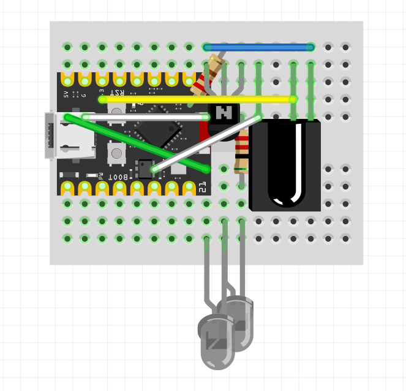

# IR Blaster Project: Bauhn TV Integration

This document summarizes the journey, discoveries, and tools created while attempting to reliably control a "Samsung-branded" (actually Bauhn/OEM) TV using an Android IR Blaster and Home Assistant's HAIR integration.

## Project Summary & Discoveries

The initial goal was to generate and inject standard Samsung IR codes into the Android IR Blaster app and Home Assistant. We began by writing scripts that mathematically translated standard 32-bit Samsung HEX codes (`E0E040BF` etc.) into raw microsecond timings and PRONTO Hex formats.

However, after these mathematically generated codes failed to trigger the TV, we captured the TV's original remote signals using Home Assistant's HAIR "Learn Command" feature. Analysis of the raw timings revealed a crucial discovery: **The TV was actually a re-badged OEM unit (likely Bauhn, Tempo, or Akai) and did NOT use standard Samsung NECx2 codes.** 

Instead, it used a complex, undocumented Pulse Distance protocol with 4 distinct gap lengths. Because there was no known standard "command map" for this protocol, mathematically generating the remaining buttons (Volume, Channel, etc.) was impossible.

**The Solution:**
1. The physical remote was used to manually capture every button using the HAIR integration, generating perfect PRONTO/RAW timings in `hair_codes2.json`.
2. A final script was run to automatically extract these perfectly captured codes, convert them to absolute values, and backport them cleanly into the Android IR Blaster backup format (`irblaster_hair_export.json`).

---

## Python Scripts Reference

During the reverse-engineering and troubleshooting phases, several Python utilities were created. Below is an explanation of what each script does and how to use it:

### 1. `pronto2raw.py`
**Purpose:** A core utility library that converts PRONTO Hex strings into raw microsecond timings. It features automatic gap padding (appending `30000` microsecond trailing gaps) and ensures burst pairs are evenly matched, which was critical for making the codes transmit reliably through Home Assistant.
**Usage:** Used primarily as an import in other scripts, but contains a `convert_pronto_to_raw()` function.

### 2. `addbuttontojson.py`
**Purpose:** A CLI tool that takes a single PRONTO Hex string, converts it to RAW timings, and safely appends it as a new button to an existing Android IR Blaster JSON backup file.
**Usage:**
```bash
python3 addbuttontojson.py "Volume Up" "0000 006D 0022 0000..." --file irblaster_backup_1783825408844.json
```

### 3. `interactive_add_button.py`
**Purpose:** An interactive prompt version of `addbuttontojson.py`. It runs in a loop, asking you for a button name and its PRONTO code, dynamically injecting them into your IR Blaster backup without needing to pass long CLI arguments.
**Usage:**
```bash
python3 interactive_add_button.py
```

### 4. `samsung_hex2raw.py`
**Purpose:** An early script that used a hardcoded dictionary of standard Samsung 32-bit hex codes and converted them directly into RAW timing lists.
**Usage:**
```bash
python3 samsung_hex2raw.py
```

### 5. `add_all_samsung_to_json.py`
**Purpose:** A batch script that automatically generates a full Samsung remote in the Android IR Blaster format. Instead of using raw timings, it relies on setting the `necx2` protocol and `protocolParams` (Hex codes) directly for higher reliability.
**Usage:**
```bash
python3 add_all_samsung_to_json.py
```

### 6. `add_samsung_to_hair.py`
**Purpose:** Designed specifically for Home Assistant. It generates a complete set of standard Samsung remote commands formatted for HAIR's `.storage` (`hair_codes.json`). It mathematically calculates the frequency and burst patterns to produce fully compliant PRONTO codes for the NECx2 protocol.
**Usage:**
```bash
python3 add_samsung_to_hair.py
```

### 7. `backport_hair_to_irblaster.py`
**Purpose:** Extracts manually captured remote commands from Home Assistant's HAIR integration JSON (`hair_codes2.json`), converts them, and backports them into a clean Android IR Blaster backup JSON format.
**Usage:**
```bash
python3 backport_hair_to_irblaster.py --input hair_codes2.json --output irblaster_hair_export.json
```

---

## Final Export File

- **`irblaster_hair_export.json`**: The final product of this project. It contains all the properly captured Bauhn, JVC, and Hisense codes from HAIR, perfectly formatted and ready to be imported into the Android IR Blaster app.

---

## Hardware & ESPHome Configuration

The physical IR blaster is built around an ESP32-C3 microcontroller. Below is the Fritzing diagram illustrating the wiring setup for the IR transmitter and receiver:



### ESPHome Configuration (`irblaster_proxy.yaml`)

This is the ESPHome configuration used to flash the ESP32-C3. It properly exposes the IR transmitter and receiver to Home Assistant via the `ir_rf_proxy` platform, which is required for the HAIR integration to detect and use it.

```yaml
substitutions:
  name: irblaster
  friendly_name: irblaster
  ap_ssid: "OpenIRBlaster Setup"

esphome:
  name: ${name}
  friendly_name: ${friendly_name}
  name_add_mac_suffix: false
  project:
    name: "jaycollett.openirblaster"
    version: "0.6.0"

esp32:
  variant: esp32c3
  flash_size: 4MB
  framework:
    type: arduino

logger:
  level: INFO

api:
  encryption:
    key: "yxMqNY/Wlr52O8Sl6wHy9RV7V8iN/S8IrPgFqEMyleE="

ota:
  - platform: esphome

wifi:
  ssid: !secret wifi_ssid
  password: !secret wifi_password
  min_auth_mode: WPA2
  ap:
    ssid: ${ap_ssid}
    ap_timeout: 0s

captive_portal:

# Define your physical hardware first
remote_transmitter:
  id: ir_tx_hardware
  pin: GPIO0
  carrier_duty_percent: 50%

remote_receiver:
  id: ir_rx_hardware
  pin:
    number: GPIO10
    mode: INPUT_PULLUP
    inverted: true
  dump: all
  idle: 30ms

# Define the Proxy that HAIR uses for auto-discovery
infrared:
  - platform: ir_rf_proxy
    name: "IR Blaster Transmitter"
    id: ir_proxy_tx
    remote_transmitter_id: ir_tx_hardware

  - platform: ir_rf_proxy
    name: "IR Blaster Receiver"
    id: ir_proxy_rx
    remote_receiver_id: ir_rx_hardware

# Basic device management
sensor:
  - platform: uptime
    name: "Uptime"
  - platform: wifi_signal
    id: wifi_rssi
    name: "WiFi Signal"
    update_interval: 30s

switch:
  - platform: restart
    name: "Restart"

text_sensor:
  - platform: wifi_info
    ip_address:
      name: "IP Address"
```
